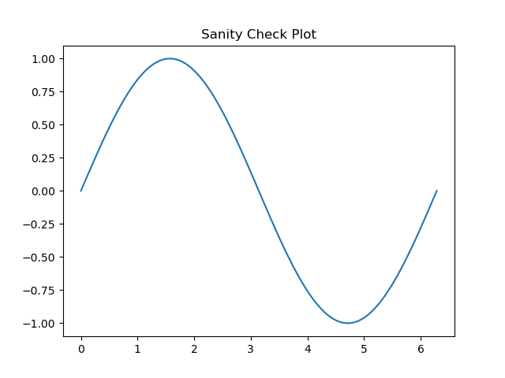
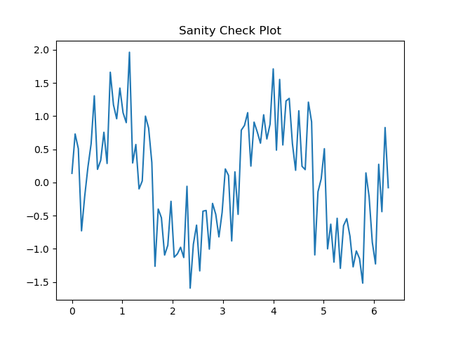
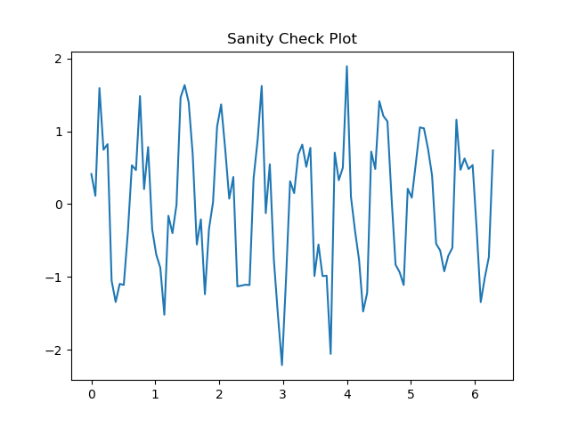
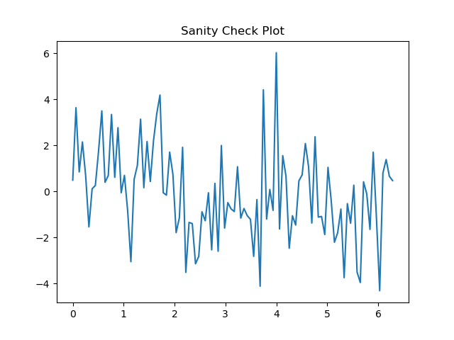

# Lab 1: Getting Your Engineering Environment Running

---

## Part 1: Environment Verification
**Objective:** Ensure the system is ready and visualize a base signal without interference.



### Code Snippet: Base Signal
```python
import numpy as np
import matplotlib.pyplot as plt

# Pure sine wave with no noise added
x = np.linspace(0, 2*np.pi, 100)
y = np.sin(x)

plt.plot(x, y)
plt.show()
```

---

## Part 2: Lab Provided Signal
**Objective:** Visualize the signal using the specific parameters provided in the lab instructions.



### Code Snippet: Provided Parameters
```python
# y = np.sin(frequency * x) + noise_level * randomness
y = np.sin(2 * x) + 0.5 * np.random.randn(len(x))
```

---

## Modified Signal 
**Objective:** Observe the effects of increasing both the frequency of the wave and the level of random noise.

### High Frequency 



### Code Snippet: Modified Parameters
```python
# Modified: Frequency increased from 2 to 10
y = np.sin(10 * x) + 0.5 * np.random.randn(len(x)) 
```

### High Noise



### Code Snippet: Modified Parameters
```python
# Modified: Noise increased from 0.5 to 2.0
y = np.sin(2 * x) + 2.0 * np.random.randn(len(x)) 
```

---

## Reflection

> **Q: What effect does noise have on the signal?**
>
> **A:** Noise introduces random fluctuations that can significantly affect the signal's pattern.

> **Q: How does increasing frequency change the plot?**
>
> **A:** Increasing the frequency results in more oscillations (cycles) within the same time frame, making the waves appear as if they are occusring much more often in a single time frame.

> **Q: What would make this data difficult to analyze?**
>
> **A:** If the noise level is too high relative to the signal strength, the original sine wave's pattern becomes completely hidden, making it much harder to identify the signal's true frequency or amplitude without filtering.
